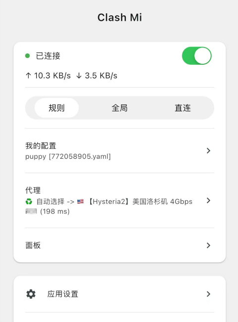
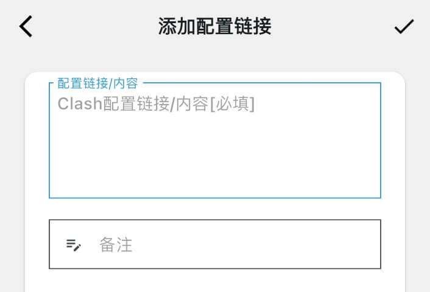
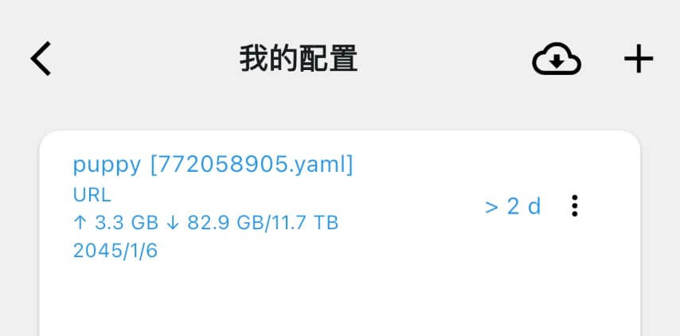

# 简明用户手册

Clash Mi 是内置`clash mihomo内核`的移动端代理工具. 开源、完全免费.

## 主要特性
- 内置Mihomo内核: 基于最新且持续更新的Mihomo(Clash Meta)内核. 内核及客户端均持续更新维护，放心使用.
- 操作简单: 支持metacubex的推荐配置, 内核基于yaml配置运行. 小白用户使用机场订阅即可使用.
- 清新UI: 新版界面, 简洁不过度设计.

## 界面预览

## 一、 下载

### iOS(iPhone/iPad)/MacOS
- 应用市场[稳定版] [AppStore](https://apps.apple.com/us/app/clash-mi/id6744321968)
- TestFlight[Beta测试版]  新功能尝鲜 [TestFlight](https://testflight.apple.com/join/bjHXktB3)
:::info 注意
  - 如果您的账号无法正常下载应用, 请尝试港区/美区等非中国大陆地区账号,或者移步:  [苹果ID专卖小店](https://dot.karing.app/pi.html?r_c=xda)
  - 应用市场版 和 TestFlight版 无法同时安装:安装应用市场版本会覆盖TestFlight版,同理安装TestFlight版会覆盖应用市场版,请您视具体情况选择要安装的版本
:::

### Android/Harmony
- [GitHub Release page](https://github.com/KaringX/clashmi/releases/latest)
  - Android 建议下载安装包: 文件名规则 clashmi_xxx_android_arm.apk (xxx为版本号)
- 小米/MIUI用户: 如遇无法安装的情况, 先打开`飞行模式(断网)` 和 `关闭安全守护-增强防护` 再安装.

### 系统要求
-  IOS >= 15
-  MacOS >= 12
-  Android >= 8

### 购买价格 {#price}
- Clash Mi是开源软件, 可免费使用.
:::tip 推广
- 这里收集了一些比较靠谱的收费节点, 请移步 [节点分享](../page/sponsor.md#list)
- 怎么获取免费流量, 请看 [新用户福利](/newuser)
:::

## 二、快速使用/quickstart {#quickstart}
1. 选择APP首页菜单`我的配置` -> 右上角 ➕ 号按钮 -> 选择`添加配置链接`
2. 返回APP首页, 滑动打开连接按钮 ▶️ 即可开始您的科学上网之旅了
3. 流程截图
   - 添加您的配置
      - 
   - 配置列表
      - 
   - 打开连接
      - 

### 使用在线面板
- 如果您习惯使用web方式操作clash, 可直接使用 菜单中的`面板`
- 面板 `secret` 可在菜单"核心设置"中找到.

## 三、进阶功能
- [yaml参考配置](/wiki/configuration-reference.md)

## 最后、常见问题/FAQ
- 请移步 [FAQ](./faq.md)

