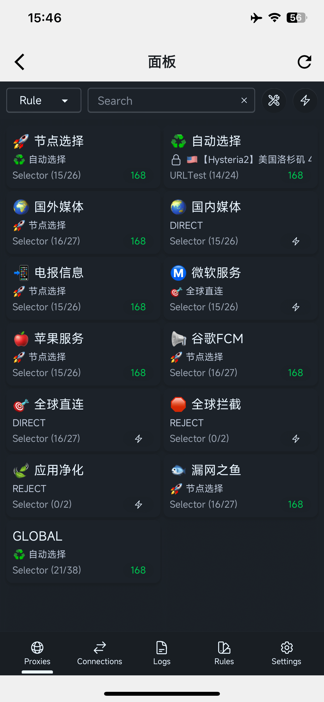
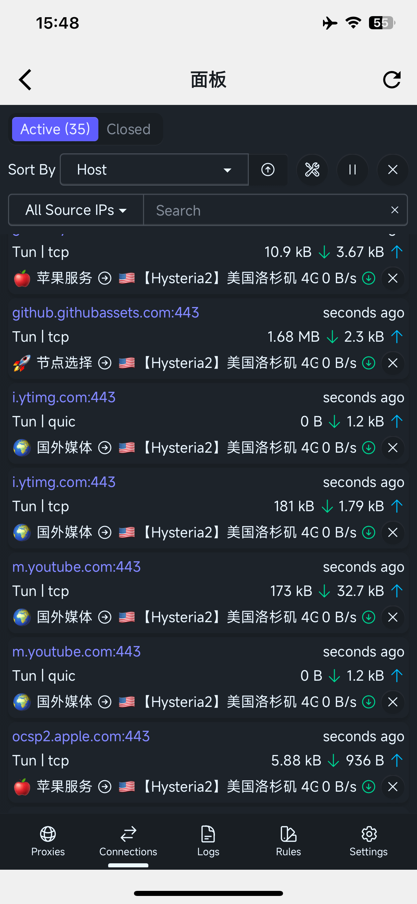

# 在线面板

## 使用
- 如果您习惯使用web方式操作clash, 可直接使用 菜单中的`面板`
- web面板 `secret` 可在菜单"核心设置"中找到.
- [zashboard GitHub repo](https://github.com/Zephyruso/zashboard)

## 默认IP及端口
- hostname: 127.0.0.1
- port: 9090
- secret: 菜单"核心设置"

## 截图
  - 
  - 

