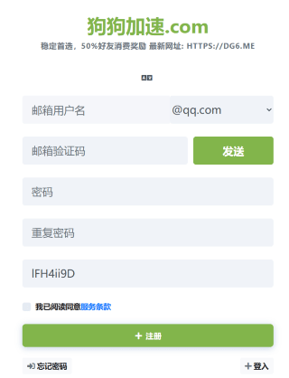
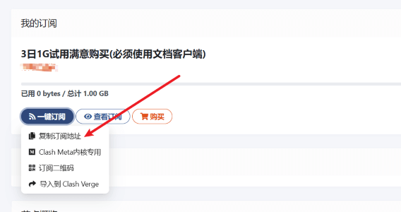
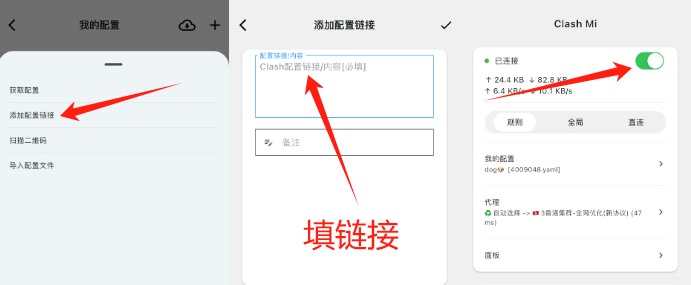

# 新人礼 免费流量

:::tip 如何领取免费流量 ？
- 由于平台限制,免费流量仅限新注册用户(**数量有限**)
- 平台介绍: [**【狗狗加速】**](https://1.x31415926.top/redir?i=3eb)
  - 高性能海外机场，❇️❇️免费试用3天❇️❇️，解锁流媒体，全球首家支持 Hysteria 协议。
  - 集群负载均衡设计，高速专线(兼容老客户端)，极低延迟，无视晚高峰，4K 秒开。
  - 充值满100送10

:::

## 1. 注册账号
- 浏览器中打开链接 [https://inv.dginv.click/#/register?code=lFH4ii9D](https://1.x31415926.top/redir?i=3eb)
- 输入电子邮箱,登录密码, 点击 *邮箱验证码*边的 `发送` 按钮, 获取邮箱验证码
  - 点击后到你的邮箱里查收验证码, 将验证码填入到 `邮箱验证码` 一栏，点击注册
  - PS: 如果收件箱中没有邮件, 可能在**垃圾箱**中

- 

## 2. 复制 “Clash Meta内核专用” 的订阅链接
- 注册成功后登录到后台,进入机场的仪表盘,如下图
- 复制链接☞ “Clash Meta内核专用”

- 

## 3. 添加 Clash Mi 配置
- 回到ClashMi -> 我的配置 -> 右上角➕ -> 添加配置连接
- 粘贴链接到输入框, 点击 右上角 ➕加号 即完成添加
- 返回到ClashMi主屏 右滑开启“连接”按钮, 即可开始使用免费流量
- 

